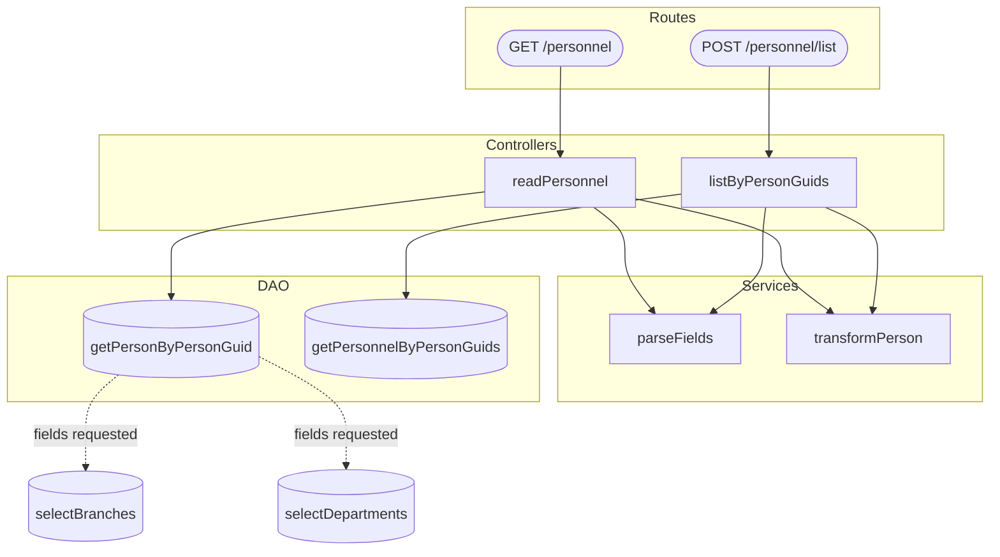

# Function Dependency Diagram

## Purpose

Scan an application folder to discover all exported and internal functions/methods, trace their call relationships, and produce a Mermaid `graph` diagram appended to a user-specified markdown file.

## Inputs

| Input | Type | Description |
|-------|------|-------------|
| `applicationFolder` | Directory path | Root folder of the application to scan |
| `markdownFilePath` | File path | Target `.md` file where the diagram will be appended |

## Steps

### 1. Validate Inputs

- Confirm `applicationFolder` exists and contains source files
- Confirm `markdownFilePath` ends with `.md`
- If either input is missing or invalid, ask the user to provide it

### 2. Discover Source Files

- Use `Glob` to locate all source files in `applicationFolder` (e.g., `*.ts`, `*.js`, `*.svelte`)
- Exclude test files (`*.spec.*`, `*.test.*`, `__tests__/`), generated files, and `node_modules/`
- Build a file list for analysis

### 3. Extract Functions and Methods

For each source file, use `Read` to parse and identify:

- **Named function declarations** — `function name() {}`
- **Arrow function assignments** — `const name = () => {}`
- **Class methods** — `class Foo { method() {} }`
- **Exported functions** — `export function`, `export const`, `export default`
- **Module-level factory functions** — functions that return objects or class instances

Record each function with:
- **Fully qualified name** — `ModuleName.functionName` or `ClassName.methodName`
- **File path** — source file location
- **Visibility** — exported or internal

### 4. Trace Call Relationships

For each discovered function, analyse its body to identify calls to other discovered functions:

1. **Direct calls** — `functionName()`, `this.method()`, `instance.method()`
2. **Imported calls** — match import statements to resolve which module a called function belongs to
3. **Chained calls** — `service.method().then(handler)`
4. **Callback/handler references** — functions passed as arguments (e.g., `array.map(transformFn)`)

Build a directed graph of caller → callee relationships. Track visited functions to avoid infinite loops on circular references.

### 5. Group by Module

Organise functions into logical groups based on their source file or class:

- **Controllers** — route handlers and entry points
- **Services** — business logic functions
- **Repositories/DAOs** — data access functions
- **Utilities/Helpers** — shared utility functions
- **Middleware** — request processing functions
- **External boundaries** — calls to external libraries or APIs (represent as terminal nodes)

Use `subgraph` blocks in the Mermaid diagram to visually group related functions.

### 6. Build the Mermaid Diagram

Construct the diagram following these rules:

- Use `graph TD` (top-down) for hierarchical applications or `graph LR` (left-right) if the graph is wide
- Declare `subgraph` blocks for each module/class grouping
- Use **node shapes** to indicate function type:
  - `([name])` stadium shape for entry points (controllers, route handlers)
  - `[name]` rectangle for standard functions
  - `[(name)]` cylindrical for data access functions
  - `{{name}}` hexagon for middleware
- Use **solid arrows** (`-->`) for direct calls
- Use **dotted arrows** (`-.->`) for conditional/optional calls
- Use **labeled arrows** (`-->|label|`) when the call context matters (e.g., error path, loop)
- Keep node IDs short and unique; use labels for readable names
- If the graph exceeds ~60 nodes, split into multiple diagrams by layer or domain

### 7. Write to Markdown File

- **Append** the diagram to `markdownFilePath` (do not replace existing content)
- Add a heading: `## Function Dependency Diagram: {applicationFolder name}`
- Add a brief legend explaining node shapes and arrow types
- Wrap the diagram in a fenced code block with the `mermaid` language identifier
- Present the result to the user for review

## Outputs

| Output | Type | Description |
|--------|------|-------------|
| Updated markdown file | File | The target file with the appended function dependency diagram |
| Summary | Text | Count of functions found, relationships mapped, and modules identified |

## Mermaid Syntax Reference

```
graph TD
    subgraph Controllers
        A([createOrder])
        B([getOrder])
    end

    subgraph Services
        C[validateOrder]
        D[processPayment]
        E[calculateTotal]
    end

    subgraph Repositories
        F[(saveOrder)]
        G[(findOrderById)]
    end

    subgraph Middleware
        H{{authenticate}}
        I{{rateLimiter}}
    end

    H --> A
    I --> A
    A --> C
    A --> E
    C -.-> D
    C -->|valid| F
    D --> F
    B --> G

    style A fill:#4CAF50,color:#fff
    style B fill:#4CAF50,color:#fff
```

## Example Output

Given application folder `svc/service/src/`, the skill would append to the target markdown file:

````markdown
## Function Dependency Diagram: svc/service/src

**Legend:**
- `([name])` — Entry point (controller/route handler)
- `[name]` — Standard function
- `[(name)]` — Data access function
- `{{name}}` — Middleware
- `-->` — Direct call
- `-.->` — Conditional/optional call


````

## Scaling Rules

- **Small apps (< 30 functions)**: Single diagram with all functions
- **Medium apps (30–60 functions)**: Single diagram grouped by subgraphs
- **Large apps (> 60 functions)**: Split into multiple diagrams by layer or domain, each appended as a separate section

## Claude Code Notes

- Use `Glob` to discover source files in the application folder
- Use `Read` to parse function declarations and bodies
- Use `Grep` to resolve import paths and locate function implementations
- Use the `Explore` subagent for tracing complex call chains across many files
- Track visited functions in a set to prevent infinite recursion on circular dependencies
