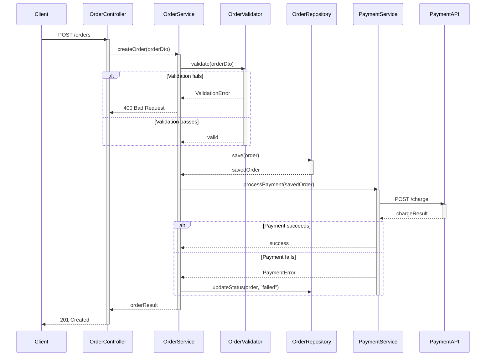

# Sequence Diagram Generator

## Purpose

Trace the call flow from a code entry point through all layers of the application and produce a Mermaid `sequenceDiagram` block, appended to a user-specified markdown file.

## Inputs

| Input | Type | Description |
|-------|------|-------------|
| `markdownFilePath` | File path | Target `.md` file where the diagram will be appended |
| `entryPoint` | File path + function/method | Starting point in the code to trace from |

## Steps

### 1. Validate Inputs

- Confirm `markdownFilePath` ends with `.md`
- Confirm `entryPoint` references a file and function/method that exists in the repo
- If either input is missing or invalid, ask the user to provide it

### 2. Look for Existing Class Diagrams

- Search the repository for Mermaid `classDiagram` blocks in markdown files using `Grep`
- If found, parse participant names and relationships as **supplementary hints**
- **Do not trust class diagram data fully** — always verify against actual source code

### 3. Trace the Call Flow

Starting from `entryPoint`, recursively trace outgoing calls across all files and layers:

1. **Read the entry point** file using `Read`
2. **Identify the function/method body** and extract all outgoing calls (method invocations, function calls, HTTP/API calls, database queries, event emissions)
3. **For each outgoing call**:
   - Use `Grep` — or the `Explore` subagent for wide sweeps — to locate the target implementation
   - Read the target file and repeat from sub-step 2
4. **Continue across layers** — follow calls through controllers, services, repositories, adapters, external API clients, message brokers, etc.
5. **Stop tracing** when reaching:
   - Leaf functions with no further outgoing calls
   - External system boundaries (HTTP endpoints, database drivers, third-party SDKs)
   - Circular references (track visited functions to avoid infinite loops)

### 4. Identify Participants

From the traced call graph, derive participants:

- **Classes/modules** that contain the traced functions become participants
- Use the class or module name as the participant label
- If a class diagram was found in step 2, use its aliases as hints for naming but verify they match actual code
- Group related participants logically (e.g., all repository classes as one "Database" participant if they share a data source)
- External systems (APIs, databases, message queues) become named participants

### 5. Build the Sequence Diagram

Construct the Mermaid diagram following these rules:

- Start with `sequenceDiagram`
- Declare all `participant` entries at the top with short aliases
- Map each traced call to a message arrow between participants
- Use **solid arrows** (`->>`) for synchronous calls
- Use **dashed arrows** (`-->>`) for responses/returns
- Use `activate`/`deactivate` to show when a participant is processing
- Use `alt`/`else` blocks for conditional branches found in the code
- Use `opt` blocks for optional/nullable paths
- Use `loop` blocks for iteration patterns
- Use `par` blocks for parallel/async operations
- Add `Note over` or `Note right of` for important context (e.g., validation, transformation)
- Keep message labels concise — use method names or short descriptions

### 6. Write to Markdown File

- **Append** the diagram to `markdownFilePath` (do not replace existing content)
- Add a heading before the diagram block with the entry point name
- Wrap the diagram in a fenced code block with the `mermaid` language identifier
- Present the result to the user for review

## Outputs

| Output | Type | Description |
|--------|------|-------------|
| Updated markdown file | File | The target file with the appended sequence diagram |
| Summary | Text | Brief description of participants and interactions found |

## Mermaid Syntax Reference

```
sequenceDiagram
    participant A as Alias A
    participant B as Alias B

    A->>B: Synchronous call
    B-->>A: Response

    activate B
    B->>C: Nested call
    C-->>B: Return
    deactivate B

    alt Condition is true
        A->>B: Do X
    else Condition is false
        A->>C: Do Y
    end

    opt Optional path
        A->>B: Maybe do this
    end

    loop For each item
        A->>B: Process item
    end

    par Parallel execution
        A->>B: Task 1
    and
        A->>C: Task 2
    end

    Note over A,B: Important context
    Note right of A: Side note
```

## Example Output

Given entry point `OrderController.createOrder()`, the skill would append to the target markdown file:

````markdown
## Sequence Diagram: OrderController.createOrder


````

## Claude Code Notes

- Use `Grep`/`Glob` for initial discovery of call targets
- Use `Grep` for locating implementations across the codebase
- Use `Read` to read function/method bodies
- Track visited functions in a set to prevent infinite recursion on circular dependencies
